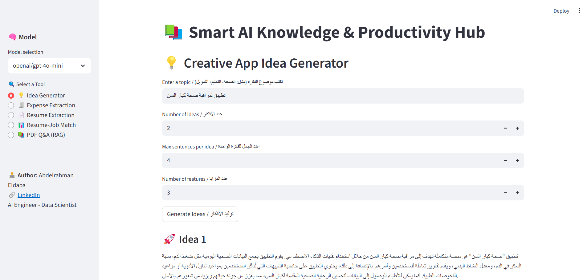
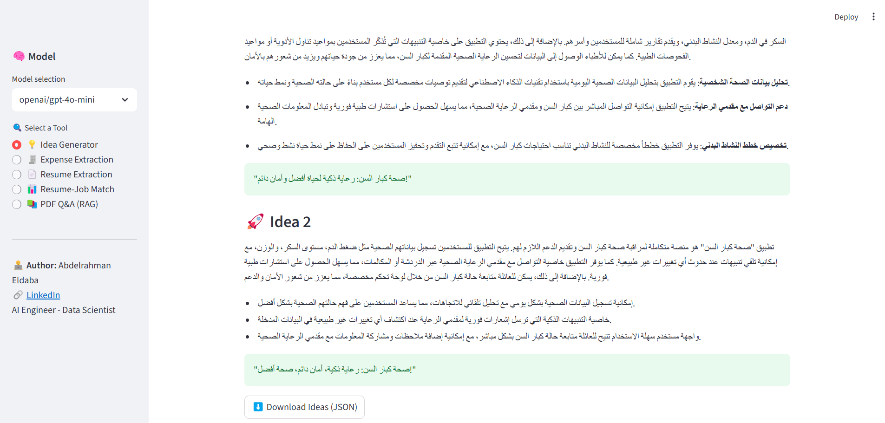
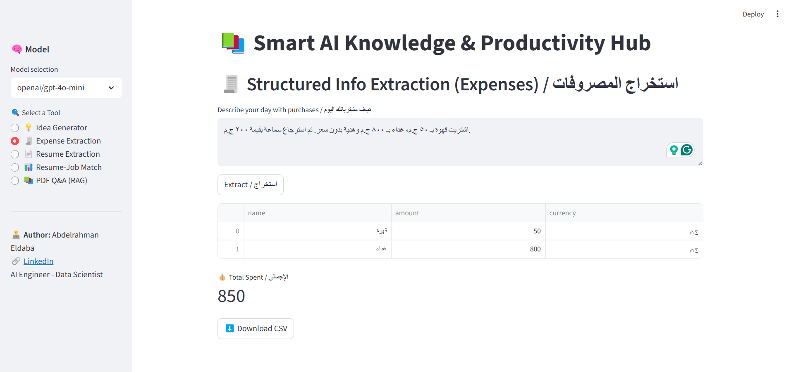
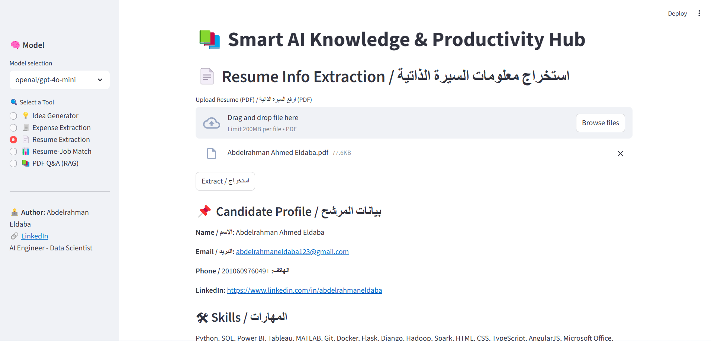
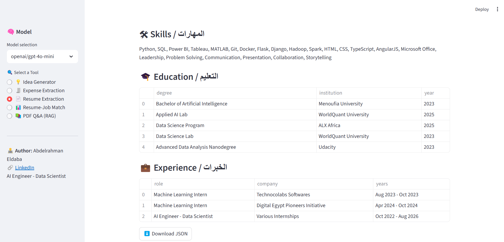
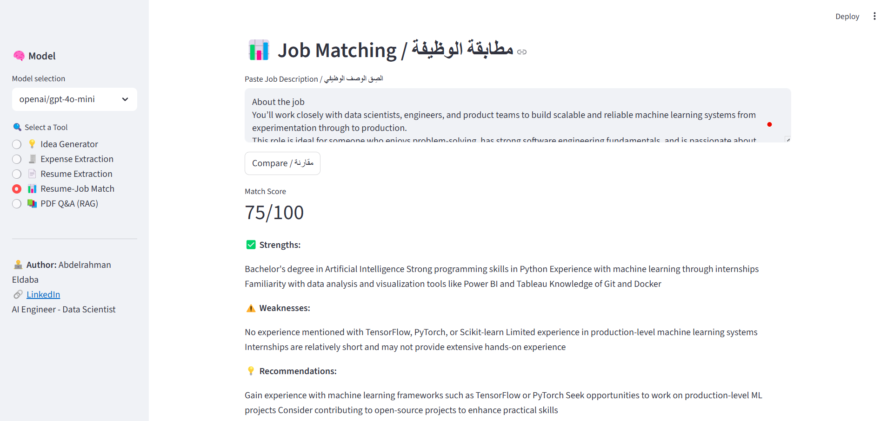
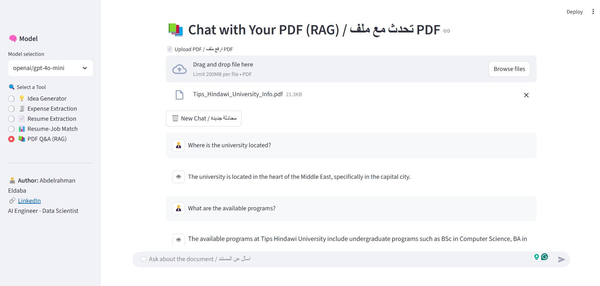

# Knowledge AI Hub

An AI-powered productivity and knowledge assistant that combines idea generation, expense tracking, resume parsing, job matching, and RAG-based Q&A into one unified hub.

## 🚀 Features

- **💡 Creative Idea Generator** – Generate innovative app/product ideas across domains.
- **🧾 Expense Parser** – Extract structured information from natural language expense descriptions.
- **📄 Resume Parser** – Extract key details (skills, education, experience) from resumes.
- **🤝 Job Matcher** – Match resumes against job descriptions with strengths, weaknesses, and recommendations.
- **🔎 RAG Q&A** – Ask questions directly from PDF documents using Retrieval-Augmented Generation.

---
## 📸 App Demo Images

---

---

---

---

---

---

---

## 🛠️ Tech Stack

- **Python** 3.10+
- **Streamlit** – Frontend UI
- **LangChain** – Document processing & chaining
- **OpenRouter API** – LLM access
- **PyPDFLoader** – PDF handling
- **dotenv** – Environment management

## 📂 Project Structure

```
knowledge_ai_hub/
├─ app.py                  # Streamlit entry point
├─ requirements.txt        # Dependencies
├─ .env.example            # Example env vars
├─ README.md               # Documentation
├─ core/                   # Core utilities
│  ├─ config.py
│  ├─ llm_utils.py
│  ├─ utils.py
│  ├─ pdf_utils.py
│  └─ lang_utils.py
├─ features/               # Main features
│  ├─ idea_generator.py
│  ├─ expense_parser.py
│  ├─ resume_parser.py
│  ├─ job_matcher.py
│  └─ rag_qa.py
└─ prompts/                # LLM prompt templates
   ├─ idea_prompts.py
   ├─ expense_prompts.py
   ├─ resume_prompts.py
   ├─ job_prompts.py
   └─ rag_prompts.py
```

## ⚙️ Setup Instructions

1. **Clone Repository**
   ```bash
   git clone https://github.com/Abdelrahman47-code/Knowledge_AI_Hub
   cd knowledge-ai-hub
   ```

2. **Create Virtual Environment**
   ```bash
   python -m venv .venv
   source .venv/bin/activate   # Mac/Linux
   .venv\Scripts\activate      # Windows
   ```

3. **Install Dependencies**
   ```bash
   pip install -r requirements.txt
   ```

4. **Setup Environment Variables**

   Copy `.env.example` → `.env` and add your keys:
   ```
   OPENROUTER_KEY=your_api_key_here
   ```

5. **Run App**
   ```bash
   streamlit run app.py
   ```

## 🧑‍💻 Development Workflow

- Keep feature-specific logic in `features/`.
- Store reusable utilities in `core/`.
- Keep all prompt templates in `prompts/`.
- Use `.env` for API keys and config.

## 🤝 Contributing

Pull requests are welcome! For major changes, please open an issue first to discuss.

---

## ✨ Connect with me
- 🌐 [Portfolio](https://sites.google.com/view/abdelrahman-eldaba110)
- 💼 [LinkedIn](https://www.linkedin.com/in/abdelrahmaneldaba)
- 📊 [Kaggle](https://www.kaggle.com/abdelrahmanahmed110)